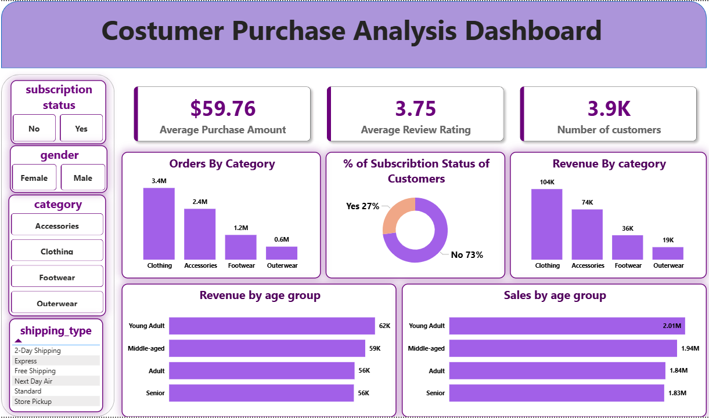

# 🛍️ Customer Shopping Behavior Analysis

## 📌 Overview
Analyzed customer shopping behavior using Python, PostgreSQL, and Power BI to identify purchasing patterns, customer segments, product performance, and subscription trends.

---

## 📈 Dashboard


---

## 📊 Dataset
- **Records:** 3,900
- **Features:** 18
- Customer Demographics
- Purchase Details
- Shopping Behavior Metrics

---

## 🛠️ Tools Used
- Python
- MySQL
- Power BI
  
---

## 💡 Key Insights
- Subscribers generated higher revenue.
- Loyal customers contributed significantly to sales.
- Express shipping customers spent more on average.
- Some products showed high dependency on discounts.
- Revenue varied across different age groups.

---

## 📂 Project Workflow

```text
Raw Data
   ↓
Data Cleaning (Python)
   ↓
Feature Engineering
   ↓
PostgreSQL
   ↓
SQL Analysis
   ↓
Power BI Dashboard
   ↓
Business Insights & Recommendations
